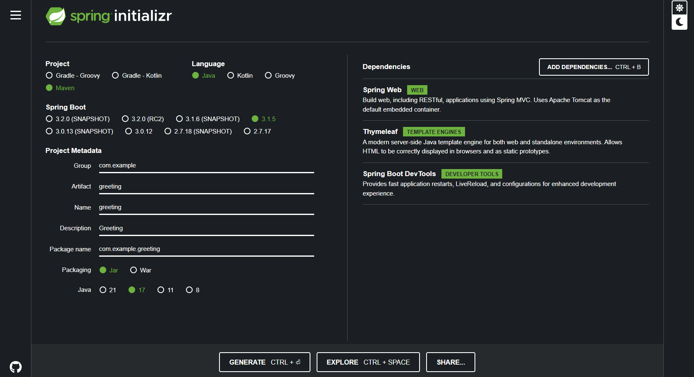

# Spring MVC Initializr

<!--  -->

To manually initialize the project:

- Spring initializr: https://start.spring.io.

- Choose either Gradle or Maven and the language you want to use.

- Click Dependencies and select Spring Web, Thymeleaf, and Spring Boot DevTools.

- Click Generate.

- Download the resulting zip file

- Extract the zip file

- Open the folder with VSCode
