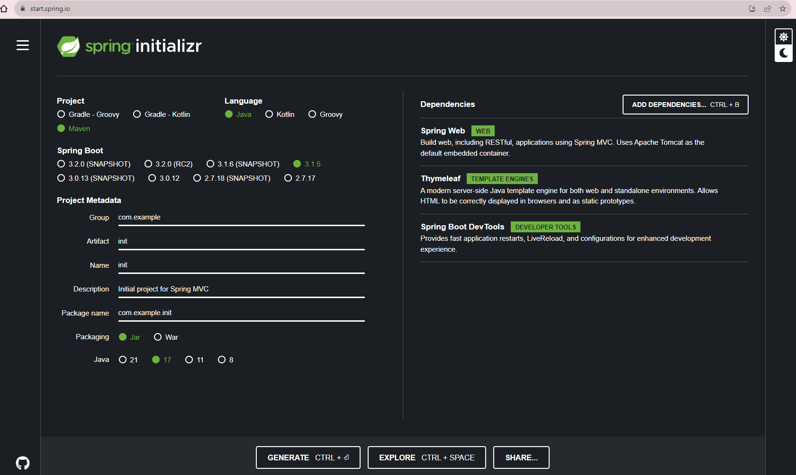
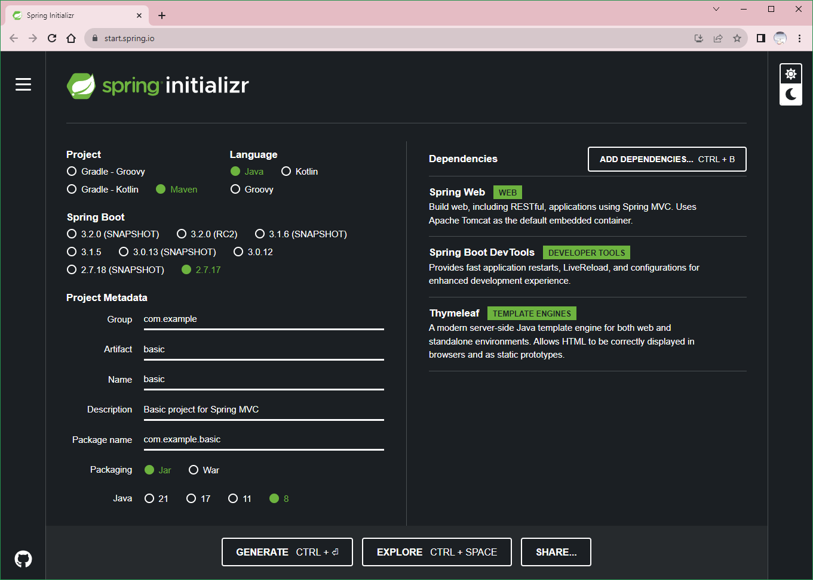
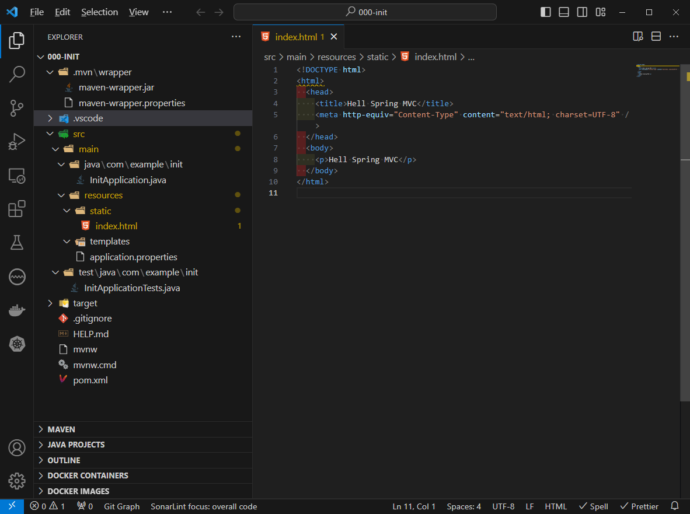
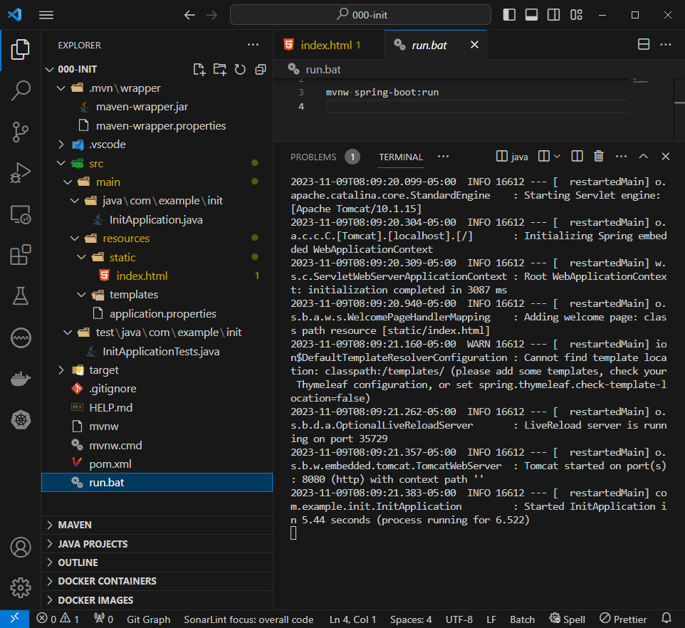
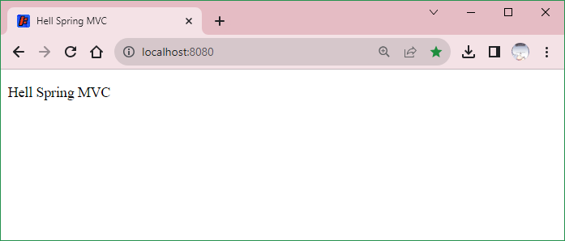

# Spring MVC Initializr

To manually initialize the project:

- Spring initializr: https://start.spring.io.

- Choose either Gradle or Maven and the language you want to use.

- Click Dependencies and select Spring Web, Thymeleaf, and Spring Boot DevTools.

JDK 17 + 3.1.5



JDK 8 + 2.7.17



- Click Generate.

- Download the resulting zip file

init.zip

- Extract the zip file

C:\MySpringMVC\000-init

- Open the `000-init` folder with VSCode

- Add a `index.html` in `src/main/resources/static/` folder

```html
<!DOCTYPE html>
<html>
  <head>
    <title>Hell Spring MVC</title>
    <meta http-equiv="Content-Type" content="text/html; charset=UTF-8" />
  </head>
  <body>
    <p>Hell Spring MVC</p>
  </body>
</html>
```



- Run the app

```dos
mvnw spring-boot:run
```



- Test the app

`http://localhost:8080/`


